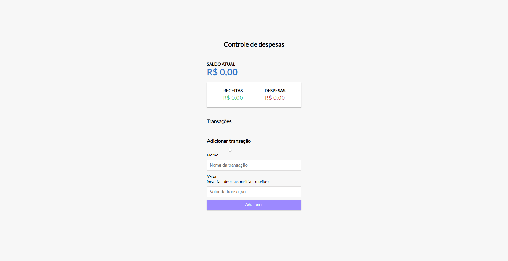

<h1>Controle de despesas </h1>
  

Aplicação feita no intuito de controlar as despesas de um usuário

A apliacação foi desenvolvida utilizando: HTML, SASS e Javascript.

<h2>Melhorias e novidades implementadas no projeto: </h2>

<ul>
  <li>Remoção e adição de despesas</li>
 <li>Salvar despesas cadastradas em localStorage</li>
</ul>
